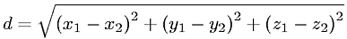
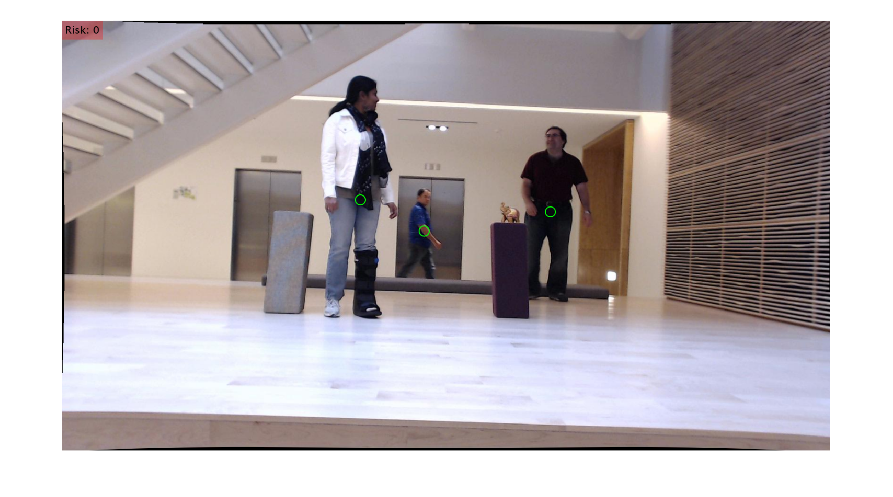
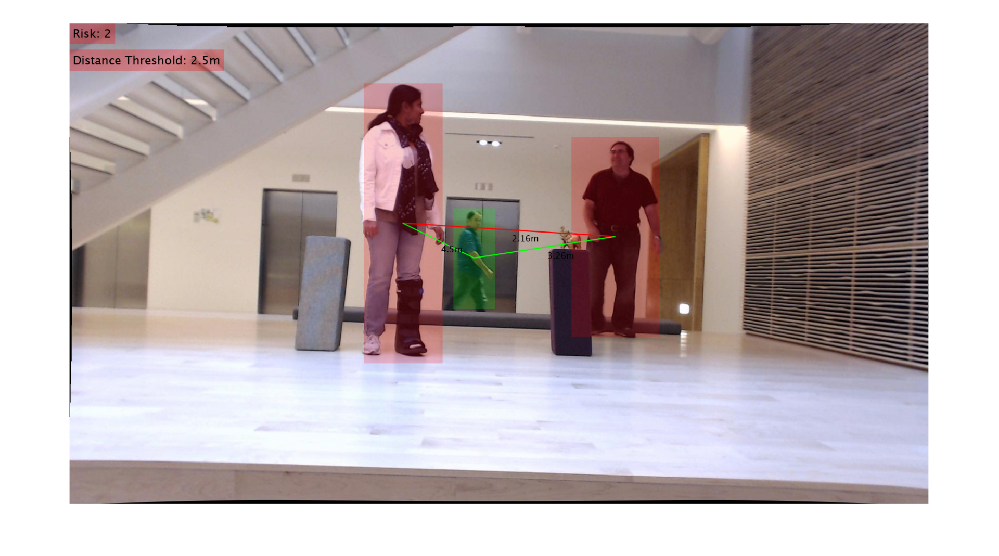

|***Table of Contents***|
|-----|
|[Simple](#simple-theory)|
|[Running](#running)|
|[Features](#features)|
|[References](#references)|

## Simple
- It is used to return the person prediction probability, bounding box coordinates for the detection, and the centroid of the person.
- Euclidean distance is then computed between all pairs of the returned centroids. Simply, a centroid is the center of a bounding box.

- Based on these pairwise distances, we check to see if any two people are less than/close to 1.5 meter apart.

## Running
|***Requirements***|
|---|
|MATLAB&reg; R2021a or later|
|Deep Learning Toolbox&trade;|
|Computer Vision Toolbox&trade;|
|[Pretrained YOLOv4]("https://github.com/matlab-deep-learning/pretrained-yolo-v4")|

> Download or clone the [***pretrained-yolo-v4***]("https://github.com/matlab-deep-learning/pretrained-yolo-v4") repository on your machine and place it in assets/libs/{_pretrained-yolo-v4_} and open it in MATLAB®.

- Add path to the source directory:
```MATLAB
addpath src\
```
- Downloading and using pretrained models for YOLO v4 human detection:
```MATLAB
pretYolov4 = PeopleDetector()...
               .loadNetwork("YOLOv4-tiny-coco")...
               .loadAnchors("YOLOv4-tiny-coco")...
               .loadClassNames("coco");
```

- Load stereo parameters:

```MATLAB
load('webcamsSceneReconstruction.mat');
```
- Read in the stereo pair of images:

```MATLAB 
frameLeft = imread('sceneReconstructionLeft.jpg');
frameRight = imread('sceneReconstructionRight.jpg');
```
- Undistort the images:
```MATLAB
frameLeft = undistortImage(frameLeft, stereoParams.CameraParameters1);
frameRight = undistortImage(frameRight, stereoParams.CameraParameters2);
```
- Detect a human in both images.
```MATLAB
detectLeft = detectPeople(pretYolov4, frameLeft, executionEnvironment= "gpu");
detectRight = detectPeople(pretYolov4, frameRight, executionEnvironment= "gpu");
```
- Find matching bounding box
```MATLAB
[detectLeft, detectRight] = matchBoundingBox(detectLeft, detectRight);
```
- 3-D locations of undistorted matching points in stereo images, [***triangulate***](https://www.mathworks.com/help/vision/ref/triangulate.html)
```MATLAB
point3d = triangulatePoints(detectLeft, detectRight, "stereoParams", stereoParams);
```

|||
|---|---|


- Calculates the distance between each person using 3D locations and finds the features to plot:
```MATLAB
zoneProp = detectedObjectProperty(point3d, detectLeft, distance= 2.5);
```
>default distance 1.5 meter
- Draws the obtained features:
```MATLAB
frameLeft = insertObjectShapes(frameLeft, zoneProp, detectLeft, ...
                                shape= "FilledRectangle", ...
                                drawSafe=true, ...
                                showDist=true);

imshow(frameLeft)
```

## Features
Features are below. You can turn them on/off.

***1. Distance:***
- Distance threshold value between two detected people. Distances lower than the threshold value are in the risk group. ```distance= 1.5 ```

***2. Shape:***
- Specifies which shape to use in the visualization. 

|shape|
|-----|
|```shape= "Rectangle"```|
|```shape= "FilledRectangle"```|
|```shape= "Circle"```|
|```shape= "FilledCircle"```|



***3. Safe Line:***
- ```drawSafe= true``` shows the lines between the non-risk group. In case of ```drawSafe= false```  it only visualizes the lines of the at-risk group.


***4. Show Distance***
- In the case of ```showDist= true``` , it prints the distances on the lines between the persons.

## References
- Pretrained YOLOv4: https://github.com/matlab-deep-learning/pretrained-yolo-v4